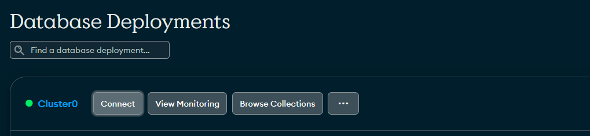
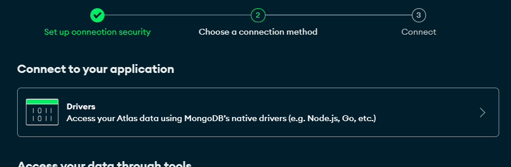
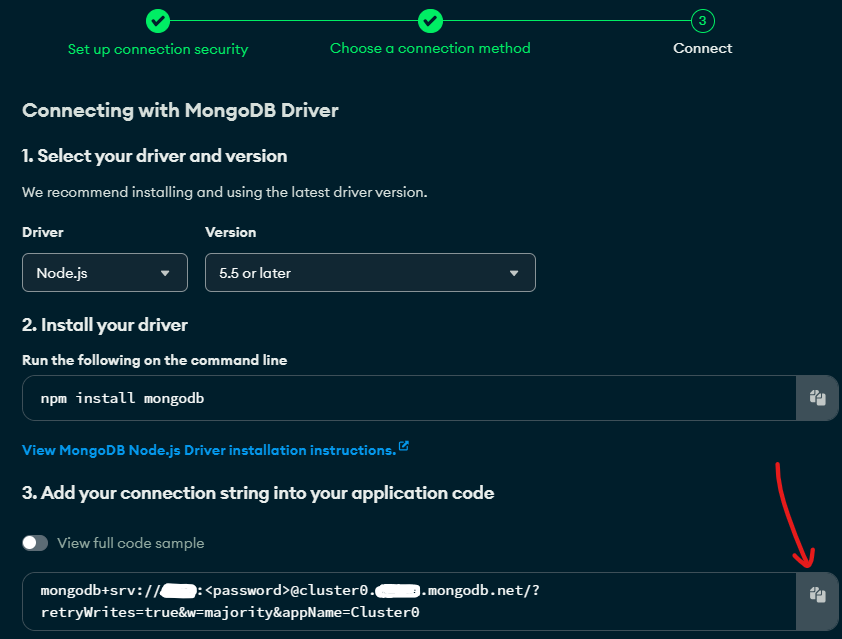
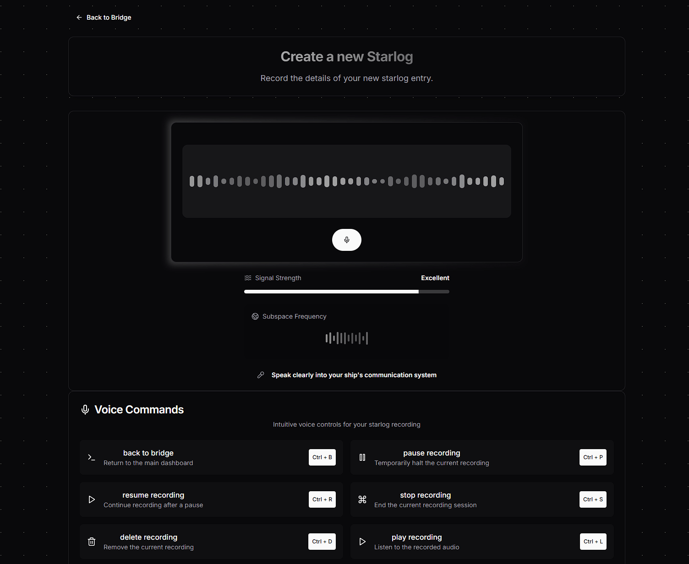

# Captain's Log - A Personal AI Transcription Logbook

<p align="center">
  
</p>

**Captain's Log** is your personal AI-powered voice transcription logbook. This innovative web application allows you to transcribe spoken words into text, organize your thoughts, and manage important notes. Built with cutting-edge technology and creative design, Captain's Log sets sail to revolutionize how you capture and manage ideas.

---

## 🚀 Deploy with One Click

[](https://vercel.com/import/project?template=https://github.com/xi-rick/captains-log)

## 🛠️ Configuration

### Prerequisites

1. **Node.js** : Install the latest LTS version from [nodejs.org](https://nodejs.org/) .

2. **MongoDB Atlas** : Set up a cloud-based MongoDB database with [MongoDB Atlas](https://www.mongodb.com/cloud/atlas) .

3. **Google Cloud Console** : Set up Google OAuth credentials for authentication.

4. **OpenAI API** : Obtain an API key for transcription services.

### Development

You need to pass an env. variable with the MongoDB connection string, as well as any variables required by `next-auth`:

```
NEXTAUTH_SECRET=
MONGO_URI=
NEXTAUTH_SECRET=
GOOGLE_APP_CLIENT_ID=
GOOGLE_APP_CLIENT_SECRET=
NEXTAUTH_URL=
OPENAI_API_KEY=
ALLOWED_EMAIL=
```

How to get these variables?

---

- [`MONGO_URI`](https://www.mongodb.com/docs/manual/reference/connection-string/)

The connection string looks something like this:

`mongodb+srv://<user>:<password>@cluster0.<org>.mongodb.net/<database_name>?retryWrites=true&w=majority`

In your cluster, click **Connect**:



Under the **Connect your application** section, click **Drivers**:



Click the Copy button next to the connection string:



Replace `<password>` with the password for your user. Ensure any option params are [URL encoded](https://dochub.mongodb.org/core/atlas-url-encoding).

---

- [`GOOGLE_APP_CLIENT_ID` and `GOOGLE_APP_CLIENT_SECRET`](https://developers.google.com/identity/oauth2/web/guides/get-google-api-clientid)

---

### Set Up NEXTAUTH_URL

When deploying to production, set the NEXTAUTH_URL environment variable to the canonical URL of your site.

```bash
NEXTAUTH_URL=https://example.com
```

If you're running locally, set it to http://localhost:3000

### Set Up NEXTAUTH_SECRET

1. Run the following command to generate a random secret and automatically add it to your .env.local file:

```bash
npx auth secret
```

### Set Up OpenAI API

1. Sign up for [OpenAI](https://platform.openai.com/) .

2. Obtain your API key from the OpenAI dashboard.

3. Add the key to `.env.local`:

4. Add a few dollars to your OpenAI account. And I do mean like 5.

```plaintext
OPENAI_API_KEY=YOUR_OPENAI_API_KEY
```

### Configure Allowed Email

Restrict access to specific email addresses:

```plaintext
ALLOWED_EMAIL=allowed@example.com
```

## 🚀 Deployment

### Local Development

1. Install dependencies:

```bash
npm install
```

2. Run the app in development mode:

```bash
npm run dev
```

The app will be accessible at `http://localhost:3000`.

### Production Deployment

1. Build the app:

```bash
npm run build
```

2. Start the production server:

```bash
npm start
```

---



## 🌌 Features

- **Voice Transcription** : Leverage OpenAI's AI for seamless voice-to-text conversion.

- **Voice Commands** : Enable users to interact with the app using voice commands.

- **Intuitive Interface** : Built with **shadcn/ui** for a sleek user experience.

- **Secure Authentication** : Powered by **NextAuth** and Google OAuth.

- **Persistent Storage** : Store data securely with MongoDB Atlas.

- **Customizable** : Easily adapt themes and functionality.

- **PWA Ready** : Offline functionality using **Next.js PWA** .

---

## 🌟 Contribution

We welcome contributions! Follow these steps to contribute:

1. Fork the repository and clone it locally:

```bash
git clone https://github.com/xi-Rick/captains-log.git
```

2. Create a new branch:

```bash
git checkout -b feature/your-feature-name
```

3. Commit your changes:

```bash
git commit -m "Add feature: your-feature-description"
```

4. Push your changes:

```bash
git push origin feature/your-feature-name
```

5. Submit a pull request on the main repository.

---

## 📜 License

This project is licensed under the [MIT License]() .

---

**Captain's Log** - Your journey, your stories, the galaxy awaits.
